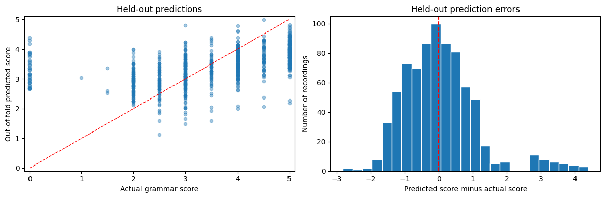

# SHL Spoken Grammar Scoring

Research Intern hiring assessment baseline by **Shruti Suman**.

Build a model that takes a spoken audio recording and returns a continuous
grammar score from 0 to 5. The dataset contains 769 training and 216 test clips.

## Status

Work in progress. The TF-IDF baseline has been evaluated in Kaggle. The MPNet
experiment is pending. No official Kaggle submission or threshold achievement
is claimed. The sample submission/test filename mismatch remains unresolved.

## Approach

1. Validate CSVs and index train/test WAV files separately.
2. Transcribe locally using frozen Whisper Turbo, beam size 5 and VAD.
3. Preserve grammatical errors; do not correct transcripts or manually relabel.
4. Combine word (1–2 gram) and character (3–5 gram) TF-IDF features.
5. Fit Ridge regression with alpha=1 and clip predictions to [0, 5].
6. Evaluate with five-fold out-of-fold RMSE and Pearson; report training RMSE.

All learned text preprocessing is fitted inside each training fold. Exact
normalized transcript duplicates, if present, are grouped. This does not detect
all shared speakers or prompts. No external labelled dataset is used.

## Observed baseline results

Actual results from the earlier private Kaggle run on 5 October 2026:

| Evaluation | RMSE | Pearson |
|---|---:|---:|
| Mean baseline, out of fold | 1.2414 | -0.0961 |
| TF-IDF + Ridge, out of fold | 1.0901 | 0.4746 |
| TF-IDF + Ridge, training fit | **0.4811** | 0.9567 |

Training fit is not an estimate of unseen-data performance. The mean baseline
uses each training fold's mean; its slightly varying pooled predictions make
its pooled Pearson uninformative. RMSE improves about 12.2% over the mean model.
Thirty-seven zero-labelled recordings contribute about 45% of squared error;
they are retained. See the notebook report for limitations and details.

## Files

- `grammar_scoring_baseline.ipynb`: complete baseline code and in-notebook report.
- `requirements.txt`: required packages; only the PyAV version is pinned so far.
- `reports/baseline_metrics.csv`: aggregate observed metrics, not dataset labels.
- `reports/baseline_validation.png`: aggregate plot from the original Kaggle run.
- `SHL_SUBMISSION_CHECKLIST.md`: first-commit and final-handoff instructions.
- `.gitignore`: excludes private data, caches, predictions and fitted models.
- `LICENSE`: MIT for the authored code; no grant over competition data or models.

## Reproduce in Kaggle

1. Join the SHL competition using your own Kaggle account and accept its rules.
2. Create a private notebook and attach the original competition dataset.
3. Import this notebook or copy its cells. Enable Internet for downloads.
4. Use a GPU for faster ASR. CPU int8 is supported but slower.
5. Run installation. If already-imported packages changed, restart once and
   continue from the import cell. PyAV 18.1.0 avoids the observed decoder error.
6. Run the remaining cells in order. ASR checkpoints are written separately to
   `/kaggle/working/train_transcripts.csv` and `test_transcripts.csv`.
7. Existing compatible checkpoints are reused. Download them privately before
   ending a session. With fresh checkpoints, ASR will run again.
8. Verify metrics and update the report if the runtime or results differ.

This reorganized notebook has cleared execution outputs and has not been
rerun on the private dataset. The supplied aggregate report and plot document
the earlier actual run. Before final submission, validate the chosen final
notebook in Kaggle and record its actual package versions. Exact versions other
than PyAV were not yet supplied; do not treat requirements as a locked runtime.

## Data and sharing rules

The competition dataset is not included. Do not commit audio, label CSVs,
transcripts, embeddings, fitted competition models, record-level predictions,
credentials or notebook outputs that expose those items. Download data only
through Kaggle after accepting the competition rules. Aggregate metrics/plots
and authored code are included. The code is also to be shared through the
competition-associated Kaggle notebook or forum as required by the supplied
public-code-sharing rule; publishing GitHub alone does not fulfill that rule.

`baseline_test_predictions.csv` is provisional, not a validated submission:
test has 216 rows; sample submission has 204 and only 25 filenames overlap.
Resolve expected IDs with the organizers/platform before official submission.

## Final handoff

The mandatory SHL form requires the actual Kaggle username, actual submission
details, publicly accessible GitHub repository, and requested final output file.
Submit the output through Kaggle and the SHL form, not as public repository data.
Update the notebook report with the final method, training RMSE, held-out RMSE,
Pearson and visualizations. Do not report validation metrics as leaderboard scores.

## Attribution

Uses OpenAI Whisper/faster-whisper and scikit-learn; their respective licenses
still apply. Pretrained model licenses are separate from this repository license.
AI assistance was used for code and debugging; the author should understand and
explain the solution during interview.

GitHub: https://github.com/ShrutiSuman08
